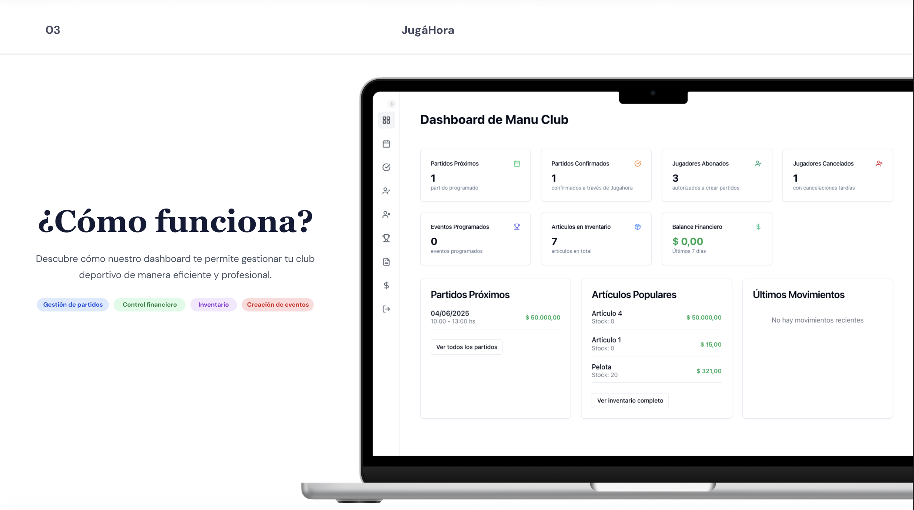
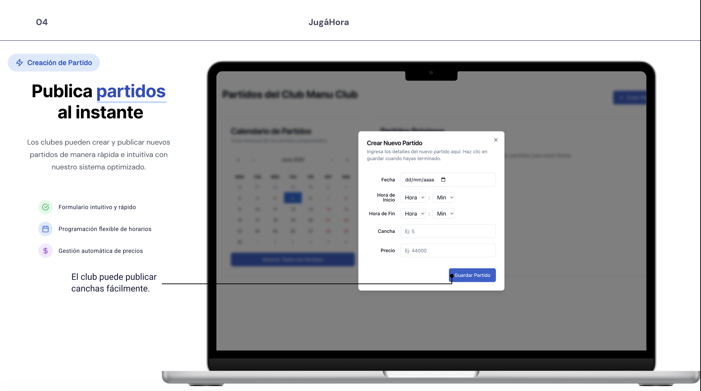
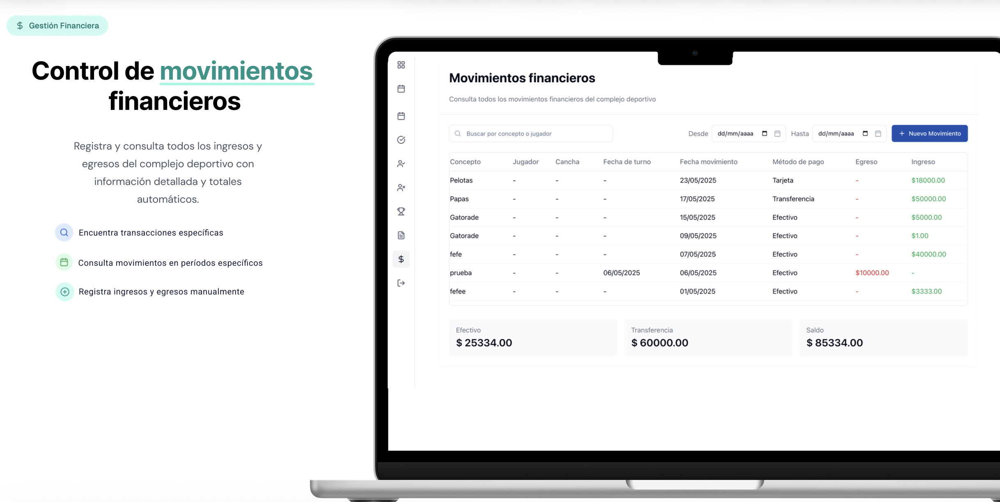

# Jugahora

Web platform designed to connect padel players and clubs based on skill level and availability.

## Overview

Jugahora simplifies match organization by helping players find compatible partners and available clubs, improving coordination and accessibility within the padel community.

The project was developed with a focus on user experience, scalability and real-world usability.

## Features

- Player registration and profiles
- Match organization by skill level
- Club and player matchmaking
- Availability management
- Responsive web interface

## Technologies

Next.js · TypeScript · Node.js · Prisma · Tailwind CSS · PostgreSQL

## Dashboard Preview

## Match Management

## Financial Dashboard

## Status

Functional full-stack web application developed as a personal project.
